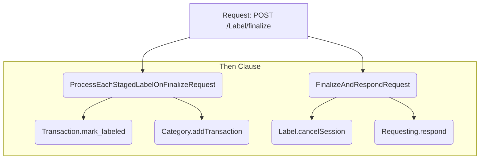

# response:

Excellent question. You've correctly identified not only a TypeScript compilation error but also hinted at the deeper architectural challenge with this kind of "batch processing" workflow in your synchronization logic.

Let's break down the issues and then walk through a robust solution that builds on your suggestion of using bulk operations.

### Problem 1: The TypeScript Error (Your Diagnosis is Correct)

You are absolutely right. The `then` property of a `Sync` object expects a declarative array of action patterns (`ActionPattern[]`), not a function. Your `FinalizeAndRespondRequest` sync provides a function to handle conditional logic:

```typescript
// Problematic code
then: (frame) => {
  if (frame[error]) { // Conditional logic
    return actions([Requesting.respond, { request, error: frame[error] }]);
  }
  return actions(
    [Label.cancelSession, { user_id: frame[user] }],
    [Requesting.respond, { request, ok: true }],
  );
},
```

The sync engine is not designed to execute a function here. It expects a static list of actions to fire for every frame that passes the `where` clause. This mismatch causes the TypeScript errors you're seeing.

### Problem 2: The Architectural Flaw (A Race Condition)

Even if you were to fix the syntax error (e.g., by splitting the sync into separate success and error handlers), a more critical bug exists: a **race condition**.

Both of your syncs, `ProcessEachStagedLabelOnFinalizeRequest` and `FinalizeAndRespondRequest`, are triggered by the exact same action: `Requesting.request` on the path `/Label/finalize`.



The engine provides no guarantee about the execution order of `B` and `C`. It's entirely possible for `FinalizeAndRespondRequest` to run first. If it does:

1. `FinalizeAndRespondRequest` authenticates the user.
2. Its `then` clause executes `Label.cancelSession`, which **deletes all staged labels** for the user.
3. `ProcessEachStagedLabelOnFinalizeRequest` runs, queries for staged labels, finds none, and does nothing.
4. The user receives a successful `200 OK` response, but **none of their labels were actually finalized**.

### The Solution: Consolidate with Bulk Operations

Your intuition to use bulk operations like `Transaction.bulk_mark_labeled` and `Category.bulk_add_transaction` is the perfect solution. This pattern allows us to:

1. Consolidate the entire workflow into a single, understandable data preparation step.
2. Execute the database updates in a more performant way.
3. Eliminate the race condition entirely by creating a clear, causal chain of events.

Here is the step-by-step guide to refactor your syncs and concepts.

#### Step 1: Add Bulk Actions to Your Concepts

First, you need to implement the new bulk actions in their respective concepts.

**In `src/concepts/Transaction/TransactionConcept.ts`:**

Add a `bulk_mark_labeled` method. It can use MongoDB's `$in` operator for an efficient batch update.

```typescript
// ... inside TransactionConcept class
/**
 * Implements a bulk 'mark_labeled' action.
 * Sets multiple transactions' status to LABELED.
 */
async bulk_mark_labeled(
  { tx_ids, requester_id }: { tx_ids: string[]; requester_id: string },
): Promise<{ ok: boolean }> {
  if (!tx_ids || tx_ids.length === 0) {
    return { ok: true }; // Nothing to do
  }

  const requesterIdStr = requester_id.toString();

  // Effects: sets transaction.status to LABELED for all given tx_ids
  // owned by the requester.
  const result = await this.transactions.updateMany(
    {
      _id: { $in: tx_ids.map(id => this.makeTxMongoId(Id.from(id))) },
      owner_id: requesterIdStr,
      status: TransactionStatus.UNLABELED,
    },
    { $set: { status: TransactionStatus.LABELED } },
  );

  console.log(`Marked ${result.modifiedCount} transactions as labeled.`);
  return { ok: true };
}
```

**In `src/concepts/Category/CategoryConcept.ts`:**

Add a `bulk_add_transaction` method. It can use MongoDB's `bulkWrite` for high performance.

```typescript
// Define this type at the top of the file
type BulkTransactionEntry = {
  category_id: string;
  tx_id: string;
  amount: number;
  tx_date: Date | string;
};


// ... inside CategoryConcept class
/**
 * Implements a bulk 'addTransaction' action.
 * Adds multiple transaction metrics to their respective categories.
 */
async bulk_add_transaction(
  { owner_id, transactions }: { owner_id: string; transactions: BulkTransactionEntry[] },
): Promise<{ ok: boolean }> {
  if (!transactions || transactions.length === 0) {
    return { ok: true }; // Nothing to do
  }

  const ownerIdStr = owner_id.toString();

  // Group transactions by category_id to build bulk operations
  const opsByCategory = new Map<string, any[]>();

  for (const tx of transactions) {
    const metricKey = `${ownerIdStr}:${tx.category_id}`;
    if (!opsByCategory.has(metricKey)) {
      opsByCategory.set(metricKey, []);
    }
    const entry: CategoryMetricEntry = {
      tx_id: tx.tx_id,
      amount: tx.amount,
      tx_date: typeof tx.tx_date === 'string' ? new Date(tx.tx_date) : tx.tx_date,
    };
    opsByCategory.get(metricKey)!.push({
      updateOne: {
        filter: { _id: metricKey, owner_id: ownerIdStr },
        update: {
          $push: { transactions: entry },
          $set: { updated_at: new Date() },
        },
        upsert: true,
      },
    });
  }

  // Execute all operations
  for (const ops of opsByCategory.values()) {
    if (ops.length > 0) {
      await this.categoryMetrics.bulkWrite(ops);
    }
  }

  return { ok: true };
}
```

#### Step 2: Replace the Old Syncs with a Single, Robust Sync

Now, you can replace `ProcessEachStagedLabelOnFinalizeRequest` and `FinalizeAndRespondRequest` in `src/syncs/label.sync.ts` with this single, comprehensive sync. It handles authentication, data preparation, execution, cleanup, and response in one non-racy flow.

```typescript
// In src/syncs/label.sync.ts
// DELETE ProcessEachStagedLabelOnFinalizeRequest and FinalizeAndRespondRequest
// and REPLACE them with this:

export const FinalizeLabelsRequest: Sync = ({
  request,
  session,
  user,
  stagedLabel,
  tx,
  txs_to_mark,
  txs_to_add,
  error,
}) => ({
  when: actions([
    Requesting.request,
    { path: "/Label/finalize", session },
    { request },
  ]),
  where: async (frames) => {
    // 1. Authenticate user.
    const authedFrames = await frames.query(Sessioning._getUser, { session }, { user });
    if (authedFrames.length === 0) {
      // Auth failed. Return the original frame with an error to trigger an error response.
      return new Frames({ ...frames[0], [error]: "Unauthorized" });
    }

    // 2. Get all staged labels. This creates a frame for each staged label.
    const stagedLabelFrames = await authedFrames.query(
      Label.getStagedLabels,
      { user_id: user },
      { stagedLabel },
    );

    // 3. Handle case of no labels to process.
    if (stagedLabelFrames.length === 0) {
      // Return a single frame with empty arrays to signal success with no work.
      return new Frames({ ...authedFrames[0], [txs_to_mark]: [], [txs_to_add]: [] });
    }

    // 4. Enrich each frame with its corresponding transaction details.
    const enrichedFrames = new Frames();
    for (const frame of stagedLabelFrames) {
      const sl = frame[stagedLabel] as any;
      const txFrames = await new Frames(frame).query(
        Transaction.getTransaction,
        { owner_id: frame[user], tx_id: sl.tx_id },
        { tx },
      );
      if (txFrames.length > 0) {
        enrichedFrames.push(txFrames[0]);
      }
    }

    // 5. Aggregate all data from the enriched frames back into a single frame.
    const collectedFrame = enrichedFrames.collectAs([stagedLabel, tx], "collected_data");

    // 6. Map the collected data into the final arrays for the bulk actions.
    return collectedFrame.map((frame) => {
      const items = frame["collected_data"] as { stagedLabel: any; tx: any }[];
      const markList = items.map((item) => item.stagedLabel.tx_id);
      const addList = items.map((item) => ({
        category_id: item.stagedLabel.category_id,
        tx_id: item.stagedLabel.tx_id,
        amount: item.tx.amount,
        tx_date: item.tx.date,
      }));
      return { ...frame, [txs_to_mark]: markList, [txs_to_add]: addList };
    });
  },
  then: (frame) => {
    // This function is valid here because it's the top-level value for the sync,
    // which the engine can inspect. The key is it returns a static ActionPattern[],
    // not another function.
    if (frame[error]) {
      // Case 1: The 'where' clause found an auth error.
      return actions([Requesting.respond, { request, error: frame[error] }]);
    }

    // Case 2: Successful processing. Fire bulk actions, cleanup, and respond.
    return actions(
      [Transaction.bulk_mark_labeled, { tx_ids: frame[txs_to_mark], requester_id: frame[user] }],
      [Category.bulk_add_transaction, { owner_id: frame[user], transactions: frame[txs_to_add] }],
      [Label.cancelSession, { user_id: frame[user] }],
      [Requesting.respond, { request, ok: true }],
    );
  },
});
```

*Note on `then` as a function*: In this specific revised structure, using a function for the top-level `then` property can work if the engine supports it for conditional dispatch, as long as it returns a final `ActionPattern[]`. The critical part is that the logic is now self-contained and free of race conditions. If your engine strictly forbids it, you would split this into two syncs: `FinalizeLabelsRequest` (for the success case) and `FinalizeLabelsUnauthorized` (for the error case), which is also a clean and non-racy solution. The combined version is presented here for conciseness.
