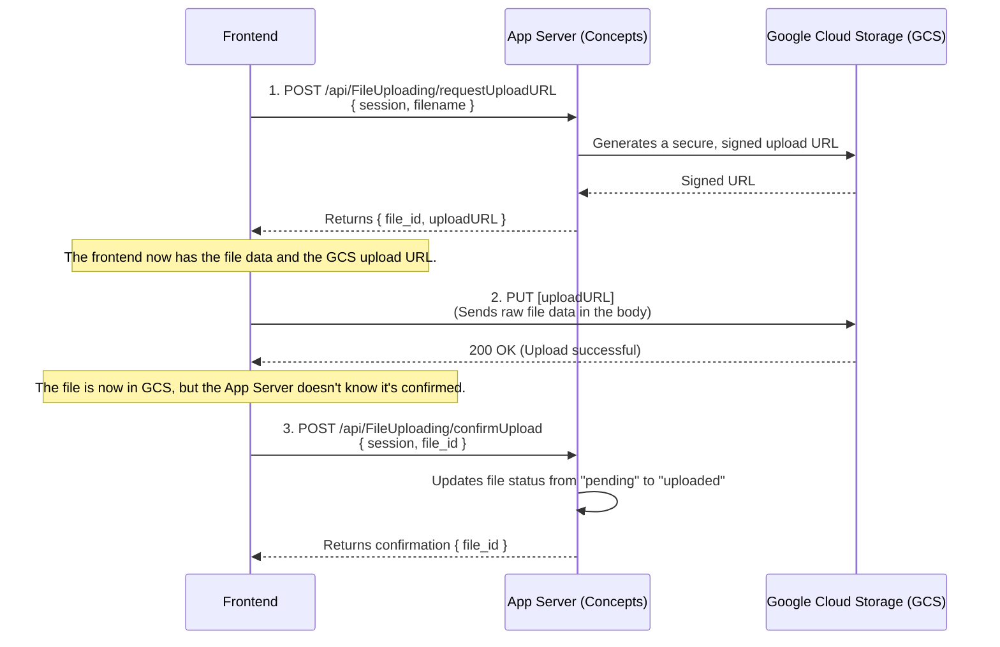

# response:

Of course. Let's walk through the entire file upload flow from the perspective of a frontend application consuming this backend.

The process is designed to be secure and efficient. Instead of your server acting as a middleman for the large file data (which would consume its bandwidth and resources), it orchestrates the process by generating secure, temporary URLs. The frontend then uses these URLs to interact directly with Google Cloud Storage (GCS).

The flow involves three main steps from the frontend's point of view:

1. **Ask your server for permission to upload:** The frontend tells the server, "I have a file named `example.png` that I want to upload." The server responds with a unique File ID and a special, one-time-use **upload URL**.
2. **Upload the file directly to the cloud:** The frontend takes the file's raw data and sends it directly to the upload URL it just received. This request goes to Google Cloud Storage, not your server.
3. **Tell your server the upload is complete:** Once the upload to GCS finishes, the frontend notifies your server using the File ID from step 1, "I'm done uploading that file." Your server then marks the file as "uploaded" and officially associates it with the user.

Here is a diagram illustrating the interactions:



### Frontend Implementation Guide

Here’s how you would implement this flow in a typical frontend JavaScript application using `fetch`.

#### Step 1: Request the Upload URL

When the user selects a file, the first thing you do is call your backend to get the signed URL.

```javascript
/**
 * Asks the backend for a secure URL to upload a file to.
 * @param {string} session - The user's session token.
 * @param {File} fileObject - The file object from an <input type="file"> element.
 * @returns {Promise<{file: string, uploadURL: string}>} An object with the new file ID and the URL for upload.
 */
async function getUploadURL(session, fileObject) {
  const response = await fetch("/api/FileUploading/requestUploadURL", {
    method: "POST",
    headers: {
      "Content-Type": "application/json",
    },
    body: JSON.stringify({
      session: session,
      filename: fileObject.name,
    }),
  });

  if (!response.ok) {
    throw new Error("Failed to get upload URL.");
  }

  return response.json();
}
```

#### Step 2: Upload Directly to Google Cloud Storage

With the `uploadURL` you received, you can now upload the file. This is a `PUT` request where the body is the file itself.

**Important:** You must set the `Content-Type` header to match the file's MIME type (e.g., `image/png`). The `FileUploadingConcept` already configured the signed URL to expect this specific content type, and GCS will reject the request if it doesn't match.

```javascript
/**
 * Uploads the file data to the provided Google Cloud Storage URL.
 * @param {string} uploadURL - The presigned URL from Step 1.
 * @param {File} fileObject - The file object to upload.
 */
async function uploadToGCS(uploadURL, fileObject) {
  const response = await fetch(uploadURL, {
    method: "PUT",
    headers: {
      "Content-Type": fileObject.type, // Crucial! e.g., 'image/jpeg', 'application/pdf'
    },
    body: fileObject, // The raw file data
  });

  if (!response.ok) {
    throw new Error("File upload to Google Cloud Storage failed.");
  }
}
```

#### Step 3: Confirm the Upload with Your Server

Finally, after the GCS upload succeeds, you must call your backend again to finalize the process.

```javascript
/**
 * Notifies the backend that the file upload is complete.
 * @param {string} session - The user's session token.
 * @param {string} fileId - The file ID received from Step 1.
 * @returns {Promise<{file: string}>} A confirmation object.
 */
async function confirmUpload(session, fileId) {
  const response = await fetch("/api/FileUploading/confirmUpload", {
    method: "POST",
    headers: {
      "Content-Type": "application/json",
    },
    body: JSON.stringify({
      session: session,
      file: fileId,
    }),
  });

  if (!response.ok) {
    throw new Error("Failed to confirm the upload with the server.");
  }

  return response.json();
}
```

### Putting It All Together

Here is a complete function that a frontend developer could use to handle the entire process.

```javascript
/**
 * Handles the complete end-to-end file upload process.
 * @param {string} session - The user's current session token.
 * @param {File} fileToUpload - The file object from a file input.
 */
async function handleFileUpload(session, fileToUpload) {
  try {
    console.log(`Step 1: Requesting upload URL for ${fileToUpload.name}...`);
    const { file, uploadURL } = await getUploadURL(session, fileToUpload);
    console.log(` -> Success! Got File ID: ${file}`);

    console.log("Step 2: Uploading file directly to Google Cloud Storage...");
    await uploadToGCS(uploadURL, fileToUpload);
    console.log(" -> Success! File is now in cloud storage.");

    console.log("Step 3: Confirming upload with our server...");
    await confirmUpload(session, file);
    console.log(" -> Success! Upload complete and confirmed.");

    alert(`${fileToUpload.name} has been successfully uploaded!`);
    return { success: true, fileId: file };
  } catch (error) {
    console.error("File upload failed:", error);
    alert(`Error uploading file: ${error.message}`);
    return { success: false, error: error.message };
  }
}

// --- Example Usage ---
// Assume 'myFileInput' is the ID of an <input type="file"> element
// and 'userSessionToken' is the user's logged-in session ID.

/*
document.getElementById('myFileInput').addEventListener('change', async (event) => {
  const file = event.target.files[0];
  if (file) {
    await handleFileUpload(userSessionToken, file);
  }
});
*/
```
